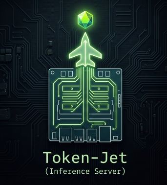
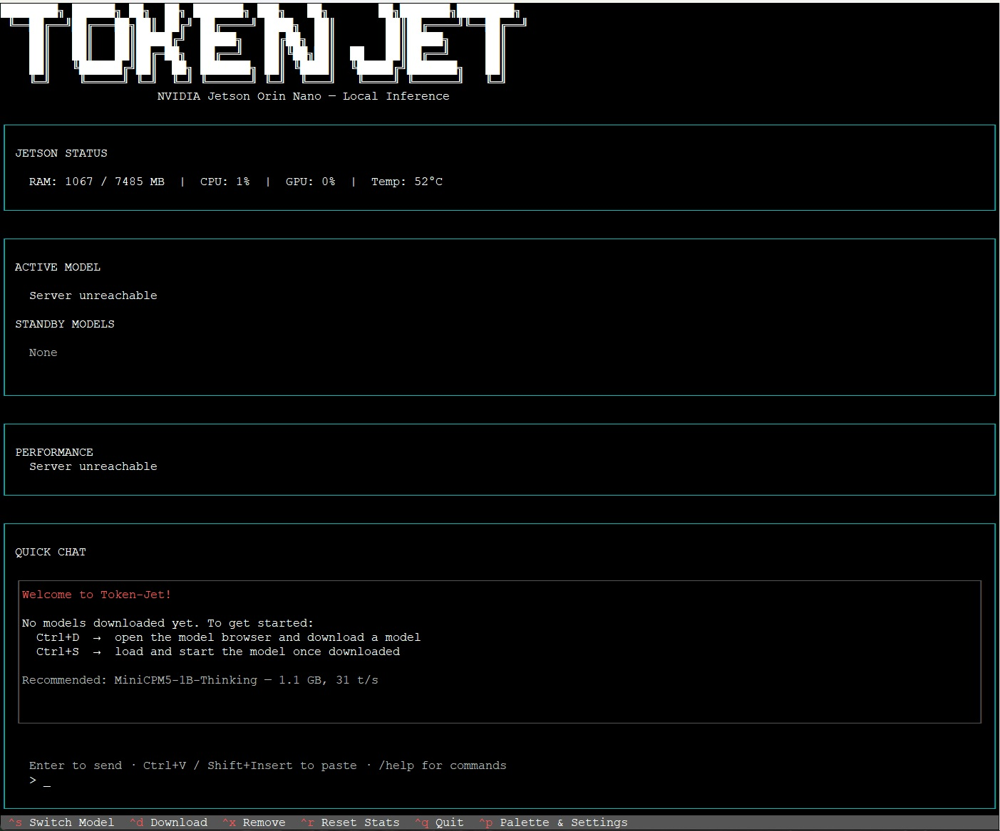
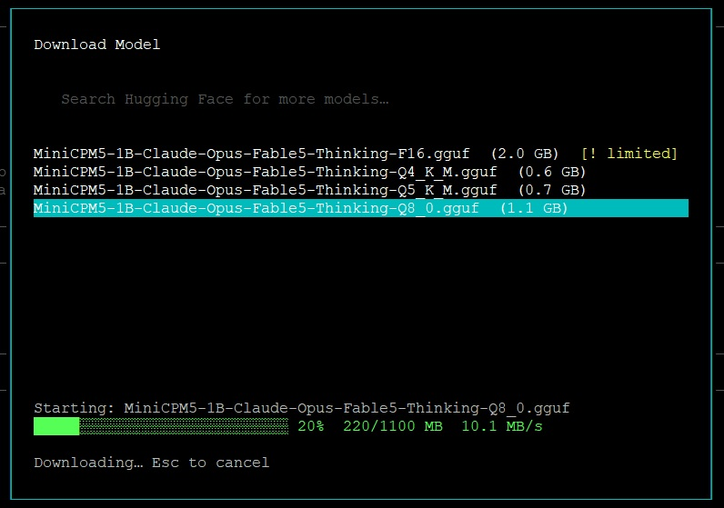
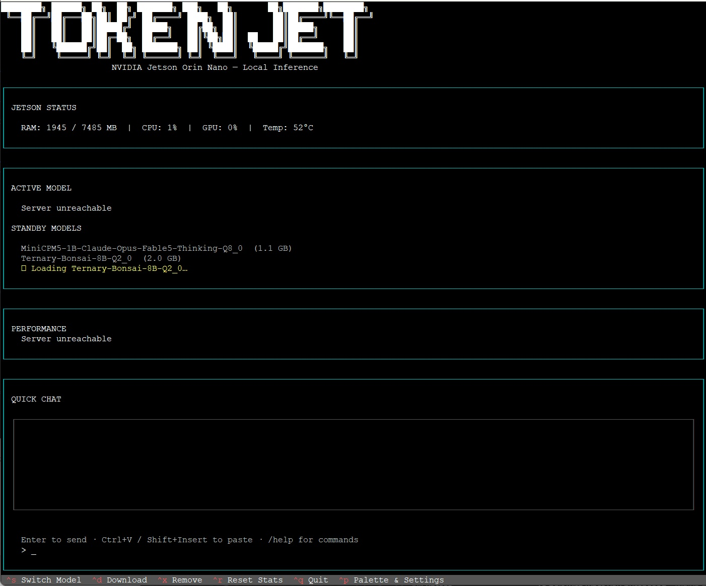
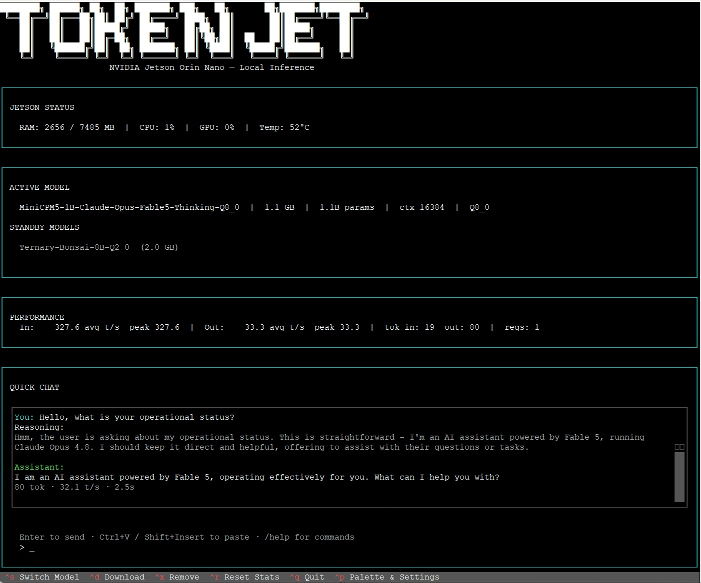

#  Token-Jet

**Run a local LLM on your NVIDIA Jetson and control it from your workstation.**

Token-Jet turns a Jetson Orin Nano into a self-contained local AI server. One command handles everything: it builds the inference engine from source, installs a terminal dashboard, and has you chatting with a model in under 30 minutes — no cloud, no subscriptions, no GPU server required.

---

## Screenshots

<table>
<tr>
<td align="center" width="50%">
<br>
<sub><b>First launch.</b> Live Jetson status (RAM · CPU · GPU · Temp) updates every second. The welcome message walks you through the two steps needed to go from zero to chatting.</sub>
</td>
<td align="center" width="50%">
<br>
<sub><b>Model browser</b> (<code>Ctrl+D</code>). Browse quantization options with file sizes, select one, and watch the live progress bar. Downloads stream directly from Hugging Face with SHA-256 verification.</sub>
</td>
</tr>
<tr>
<td align="center" width="50%">
<br>
<sub><b>Model switch</b> (<code>Ctrl+S</code>). Both downloaded models appear in the standby list. The spinner shows the server reloading — typically 5–15 seconds.</sub>
</td>
<td align="center" width="50%">
<br>
<sub><b>Active chat.</b> Thinking models surface their reasoning trace before the answer. The performance panel shows live throughput (33.3 t/s output here). Token count and latency appear below each reply.</sub>
</td>
</tr>
</table>

---

## Prerequisites

### Hardware

- **NVIDIA Jetson Orin Nano 8 GB** (4 GB may work but is not tested)
- A network connection during install — the script clones repos and the TUI downloads models from Hugging Face

### Software — what JetPack gives you out of the box

Token-Jet is designed to work with a **stock JetPack 6.x image** (Ubuntu 22.04). Everything below comes pre-installed:

| What | Why it's needed |
|------|----------------|
| Ubuntu 22.04 | Base OS |
| CUDA 12.x + cuDNN | GPU inference via llama.cpp |
| Python 3.10 | TUI and jetson-infer utility |
| `curl`, `git` | Bootstrap and source cloning |

> **Haven't flashed JetPack yet?** See [`docs/hardware-setup.md`](docs/hardware-setup.md) for a step-by-step guide from unboxed device to ready-to-install.

### Software — what the installer adds

The install script handles all of this automatically — you don't need to do it by hand:

| What | Where it lands |
|------|---------------|
| `cmake`, `build-essential`, `cuda-nvcc`, `libcublas-dev` | System packages (via `apt`) |
| Node.js 22 | System package (via NodeSource — required by pi and pi-web) |
| llama.cpp (CUDA build) | `~/llama.cpp/` |
| PrismML llama.cpp fork | `~/llama.cpp-prism/` (for Bonsai ternary models) |
| Token-Jet TUI | `~/.local/share/token-jet/` (isolated Python venv) |
| `jetson-infer` utility | `~/bin/jetson-infer` |
| `token-jet` launcher | `~/.local/bin/token-jet` |
| pi coding agent | `~/.npm-global/bin/pi` (global npm install) |
| pi-web browser UI | `~/.npm-global/bin/pi-web` (global npm install) |
| Default config | `~/.config/token-jet/config.toml` |
| `jetson-infer` systemd service | Auto-starts inference server on boot |
| `pi-web` systemd service | Auto-starts browser UI on boot, port 30141 |

---

## Install

### Option 1 — On the Jetson directly (recommended)

Log into the Jetson (directly at a keyboard, or over SSH from any machine) and run:

```bash
curl -sL https://raw.githubusercontent.com/o3willard-AI/Token-Jet/main/scripts/install-local.sh | bash
```

> **Do not add `sudo`** to the curl command. The script calls `sudo` itself only for the steps that need it (`apt` package installs, performance mode, enabling user lingering). Running the whole thing as root would install everything under `/root/` and break the paths.

**What happens next** (the script runs unattended — expect 30–45 minutes total):

1. Clones this repo to `~/Token-Jet`
2. Installs `cmake`, `build-essential`, and `cuda-nvcc` if missing
3. Installs Node.js 22 via NodeSource if not already present
4. Detects your CUDA version and architecture automatically
5. Clones and builds `llama.cpp` from source with CUDA support *(~15–25 min)*
6. Clones and builds the PrismML fork for Bonsai GPU support *(~10–15 min)*
7. Installs the TUI into an isolated Python venv
8. Deploys `jetson-infer` and creates the `token-jet` launcher
9. Installs the pi coding agent and pi-web browser UI via npm
10. Writes a default config, enables the inference server service, and starts the pi-web service

When it finishes:

```bash
source ~/.bashrc
token-jet
```

### Option 2 — From a Mac, Linux, or Windows (WSL) workstation

If you'd rather drive the install remotely, clone the repo on your **workstation** and point the installer at your Jetson's IP address:

```bash
git clone https://github.com/o3willard-AI/Token-Jet.git
cd Token-Jet
./scripts/install.sh <jetson-ip>
```

The installer SSHs into the Jetson, runs the same deployment steps remotely, then creates a `token-jet-tui` launcher on your workstation that opens the TUI over SSH.

**Options:**

```
./scripts/install.sh <jetson-ip> [options]

  --user USER        Jetson SSH username (default: ubuntu)
  --pass PASS        SSH password (prompted if omitted)
  --no-pass          Use key-based SSH auth instead
  --upgrade          Re-deploy source files; preserve config and models
  --self-update      Pull latest from GitHub, then upgrade automatically
  --uninstall        Remove Token-Jet from the Jetson
  --no-prism-build   Skip PrismML fork build (if you don't use Bonsai models)
```

**Tip — skip the password prompt with SSH keys:**

```bash
ssh-copy-id ubuntu@<jetson-ip>
./scripts/install.sh <jetson-ip> --no-pass
```

---

## First Run

1. **Launch the TUI:**

   ```bash
   token-jet        # if installed on the Jetson directly
   token-jet-tui    # if installed from a workstation
   ```

2. **Download a model** — press `Ctrl+D` to open the model browser.  
   Select any model from the curated list and press `Enter` to see its GGUF files, then `Enter` again to start downloading. **Qwen3.5-4B-Coder** is the recommended starting point — reliable for both chat and agent/coding tasks.

3. **Load the model** — press `Ctrl+S`, select the model you downloaded, press `Enter`.  
   A status line shows the server starting up. Takes 5–15 seconds.

4. **Chat** — type in the input box at the bottom and press `Enter`.  
   Thinking models display their reasoning process before the answer.

---

## TUI Keyboard Reference

| Key | Action |
|-----|--------|
| `Ctrl+D` | Download a model (model browser) |
| `Ctrl+S` | Switch the active model |
| `Ctrl+X` | Remove a downloaded model |
| `Ctrl+R` | Reset performance counters |
| `Ctrl+P` | Palette & Settings (theme, screenshot) |
| `Ctrl+Q` | Quit |
| `Enter` | Send chat message |
| `Ctrl+V` / `Shift+Insert` | Paste clipboard into chat |
| `Esc` | Close any open dialog |

---

## Recommended Models

After evaluating models across coding tasks, IT troubleshooting scenarios, and real-world agent usage on the Jetson Orin Nano 8 GB, we recommend these three. Assessments reflect July 2026 observations.

| Model | Size | Speed | Max Context | Agent/Coding | Best For |
|-------|------|:-----:|:-----------:|:------------:|----------|
| **Qwen3.5-4B-Coder** ⭐ | 2.5 GB | 20 t/s | 32K | ✅ | Recommended starting point — reliable for chat, coding, and agent tasks |
| **Ternary-Bonsai-8B** | 2.0 GB | 8 t/s | 16–20K | ✅ | Maximum accuracy on complex code generation |
| **MiniCPM5-1B** | 1.1 GB | 31 t/s | 32K | ❌ | Speed exploration and quick Q&A only |

All three are available directly from the TUI model browser (`Ctrl+D`).

### Qwen3.5-4B-Coder (Q4_0) ⭐ Recommended

The reliable all-rounder. Solid code generation, dependable multi-step agent behavior, and 32K context at 20 t/s. The Q4_0 quant keeps it under 2.5 GB. This is the model to start with and return to as a baseline when evaluating others.

### Ternary-Bonsai-8B (Q2_0)

The accuracy leader. Ternary-trained weights (values constrained to {−1, 0, +1} during training) packed into standard Q2_0 format — consistently handles complex coding challenges that trip up the others. Requires the PrismML llama.cpp fork for GPU inference (installed automatically). The cost is speed — 8 t/s. Best for batch or offline work where quality matters more than responsiveness.

### MiniCPM5-1B (Q8_0)

The fastest option at 31 t/s with a 1.1 GB footprint. Claude-distilled. Useful for exploring how fast a 1B model can run on Jetson hardware and for simple Q&A where latency is the priority. **Not suitable for agent or coding tasks** — 1B parameters is insufficient for reliable multi-step tool use.

### Trade-offs at a glance

- **Speed:** MiniCPM5 (31 t/s) ≫ Qwen3.5 (20 t/s) ≫ Bonsai-8B (8 t/s)
- **Context:** MiniCPM5 = Qwen3.5 (32K) > Bonsai-8B (16–20K, memory-dependent)
- **Code quality:** Bonsai-8B > Qwen3.5 ≫ MiniCPM5
- **Agent reliability:** Qwen3.5 ✅ · Bonsai-8B ✅ · MiniCPM5 ❌
- **Disk footprint:** MiniCPM5 (1.1 GB) < Bonsai-8B (2.0 GB) < Qwen3.5 (2.5 GB)

---

## pi Coding Agent Integration

Token-Jet installs and fully configures the [pi coding agent](https://github.com/earendil-works/pi) as part of the standard install. A provider extension registers your Jetson as a local model source and adds native tools and slash commands that let you manage models from within pi without leaving the terminal.

### What it adds

**Tools the model can call** (invoked by the model in response to natural language requests):

| Tool | What it does |
|------|-------------|
| `web_search` | Search DuckDuckGo — returns titles, links, and snippets, no API key needed |
| `fetch_url` | Fetch any URL and return its readable text as Markdown |
| `list_models` | List all downloaded GGUF models and show which one is currently active |
| `switch_model` | Stop the current model and restart the server with a different one |

**Slash commands** (typed directly by you in the pi input bar):

| Command | What it does |
|---------|-------------|
| `/models` | Show all downloaded models with sizes and active marker |
| `/switch` | Interactive model picker — select with arrow keys, or pass a filename directly: `/switch qwen3.5-4B-super-coder.Q4_0.gguf` |

After a model switch completes, type `/quit` and reopen pi — your session is restored and pi reconnects to the new model.

### Setup

The install script handles everything automatically. When complete, SSH into the Jetson and run `pi` — the Jetson provider is already configured:

```bash
ssh sblanken@<jetson-ip>
pi
```

Or use pi-web (see below) to open a browser session without SSHing.

The `ddg-search` and `fetch-url` CLI wrappers are installed to `/usr/local/bin/` and can also be called directly from any shell session.

### Thinking model behaviour

All models run with `--reasoning auto`, which routes `<think>...</think>` tokens into a separate reasoning field. Pi surfaces this as a collapsible reasoning trace — the actual reply appears cleanly in the chat panel regardless of how much the model thought.

---

## pi-web Browser UI

The installer also sets up [pi-web](https://github.com/agegr/pi-web) — a browser-based frontend for pi that runs as a background service on the Jetson and is accessible from any machine on your local network.

### Access

Once the installer finishes, open this URL in your workstation browser:

```
http://<jetson-ip>:30141
```

For example: `http://192.168.1.91:30141`

No login, no tunnel, no extra setup — pi-web reads pi's session files directly from `~/.pi/agent/sessions/` on the Jetson.

### What pi-web gives you

- Browse all previous pi conversations by project, without digging through terminal history
- Continue any session or fork it into a new direction from any earlier message
- Full file browser alongside the chat — preview source, docs, images, and PDFs
- Model configuration panel — switch providers, add API keys, test models from the UI
- Context usage, cost, and compaction state visible from the top bar

### How it runs

pi-web starts automatically as a systemd user service on every boot:

```bash
systemctl --user status pi-web      # check status
systemctl --user restart pi-web     # restart after config changes
journalctl --user -u pi-web -f      # stream logs
```

The service binds to `0.0.0.0:30141` so it's reachable from your workstation. It has no application-level authentication — only use it on a trusted local network.

pi-web is pulled directly from the upstream npm package (`@agegr/pi-web`) during install, so you always get the latest release. To update it independently:

```bash
npm install -g @agegr/pi-web && systemctl --user restart pi-web
```

---

## Configuration

`~/.config/token-jet/config.toml` on the Jetson controls inference server behaviour. The installer writes sensible defaults; edit it to tune:

```toml
# Token-Jet configuration
model_dir          = "/home/ubuntu/models"
llama_cpp_bin      = "/home/ubuntu/llama.cpp/build/bin"
server_host        = "127.0.0.1"
server_port        = 1234

# Model to load on 'jetson-infer start'. If unset, jetson-infer uses the
# project-recommended model (Qwen3.5-4B-Coder) if downloaded, then falls
# back to the first .gguf found in model_dir.
# startup_model = "/home/ubuntu/models/qwen3.5-4B-super-coder.Q4_0.gguf"

# Cap thinking tokens to control verbosity on reasoning models (0 = no cap).
# 512–1024 works well for most tasks; raise for complex multi-step problems.
# reasoning_budget = 1024
```

After editing, restart the server to pick up changes:

```bash
jetson-infer stop && jetson-infer start
```

---

## Update / Uninstall

**If installed on the Jetson directly:**

```bash
# Update TUI and jetson-infer (preserves config, models, and llama.cpp builds)
~/Token-Jet/scripts/install-local.sh --upgrade

# Remove Token-Jet (models in ~/models/ and config are not deleted)
~/Token-Jet/scripts/install-local.sh --uninstall
```

**If installed from a workstation:**

```bash
# Pull latest and upgrade
./scripts/install.sh <jetson-ip> --self-update

# Remove Token-Jet from the Jetson
./scripts/install.sh <jetson-ip> --uninstall
```

---

## OpenAI-Compatible API

Once a model is running, any OpenAI-compatible client can connect directly:

```bash
curl http://<jetson-ip>:1234/v1/chat/completions \
  -H "Content-Type: application/json" \
  -d '{"model":"local","messages":[{"role":"user","content":"hello"}],"max_tokens":256}'
```

Endpoint: `http://<jetson-ip>:1234/v1`

---

## jetson-infer CLI (on the Jetson)

```bash
jetson-infer start                                  # Start the default model
jetson-infer start --model ~/models/foo.gguf        # Start any model by full path
jetson-infer start --watchdog                       # Start with health + memory monitoring
jetson-infer status                                 # Show running model, memory, health
jetson-infer stop                                   # Stop the server
jetson-infer models                                 # List downloaded models + estimated context
jetson-infer install                                # Install systemd service (auto-start on boot)
```

`jetson-infer` calculates the largest context window that fits in available memory using your model's architecture (KV heads, head dimension, layer count) rather than a crude file-size heuristic. On a fresh 8 GB Jetson with one model loaded, typical results:

| Model | Context allocated |
|-------|:-----------------:|
| Qwen3.5-4B-Coder | 32768 |
| Ternary-Bonsai-8B | 16384–20480 |
| MiniCPM5-1B | 32768 |

The **default model** is set in `~/.config/token-jet/config.toml`:

```toml
startup_model = "/home/ubuntu/models/qwen3.5-4B-super-coder.Q4_0.gguf"
```

---

## Project Structure

```
Token-Jet/
├── jetson-infer              # Inference server utility (runs on the Jetson)
├── jetson-infer.service      # Systemd user service — auto-starts inference server
├── pi-web.service            # Systemd user service — auto-starts pi-web on port 30141
├── tui/                      # Terminal dashboard (Textual)
│   └── token_jet_tui/
├── pi/                       # pi coding agent extension
│   ├── jetson-provider.ts    # Provider + tools + /models and /switch commands
│   └── ddg-search/           # DuckDuckGo search skill (Node.js)
├── scripts/
│   ├── install-local.sh      # Install directly on the Jetson (recommended)
│   └── install.sh            # Install remotely from a workstation
├── eval/
│   ├── coding-eval.py        # 5-task coding benchmark
│   └── it-eval.py            # 5-scenario IT troubleshooting test
└── docs/
    ├── hardware-setup.md     # Jetson Orin setup from scratch
    ├── model-results.md      # Full eval results
    └── resilience.md         # Watchdog, auto-recovery, memory monitoring
```

---

## License

MIT — see [LICENSE](LICENSE).
